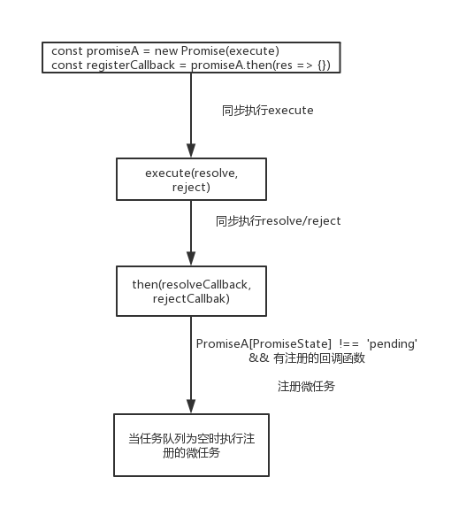

# Promise
符合PromiseA+规范的Promise类,仅作为学习Promise而练习
## 测试
```
npm install

npm run test
```
## promise流程图


## 问题
### 1. 为什么this[PromiseState] === 'pending'无法确保Promise未执行resolve/reject
根据The Promise Resolution Procedure2.3.3 .
如果
```
const promiseA = new Promise((resolve, reject) => {
  resolve(new Promise((resolve, rject) =>{
    setTimeout(() => {
      resolve(0)
    }, 0)
  }))
  reject(1)
})
const PromiseB = promiseA.then(res => {
  console.log(res)
}, err =>{
  console.log(err)
})
```
第一次resolve需要等待内部Promise的resolve后才执行resolve,如果依赖[PromiseState],则会执行reject。在复杂异步下，很难控制改变状态的时机，因而Promise[PromiseState]不可信。
需要用额外的参数来控制Resolve,reject只能执行一次.(闭包)

### 2. 为什么用全局Map保存回调与链式调用的顺序
保持Promise的纯净性，如果在Promise保存回调与链式Promise，在传递过程中会比较复杂。因而创建全局Map保存所需要的数据。

### 3. 可以使用defineProperty/Proxy,在Promise状态改变时执行delayToNextTick吗？
Proxy不可行，破坏promise纯洁性，因为需要对proxy进行操作触发delayToNextTick，逻辑变得更为复杂，可能创建一个Map用于控制连接两者的关系，但显得多余。
defineProperty也需要设置局部变量，理由与Proxy相同，因此也不采纳。

